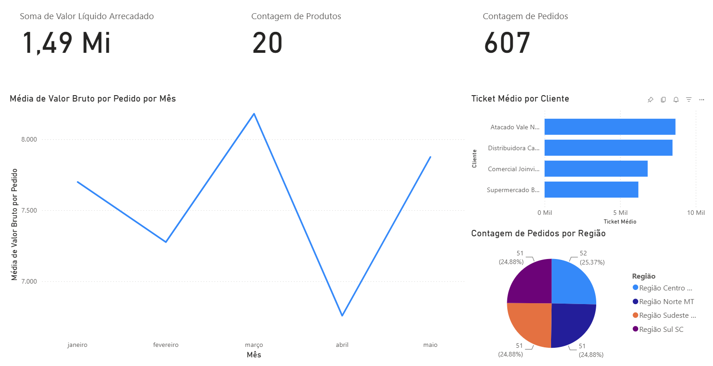

# Plataforma de Inteligência Operacional — VendaMais

## Descrição do Projeto

Este projeto tem como objetivo o desenvolvimento de uma Plataforma de Inteligência Operacional para a empresa VendaMais Distribuidora Ltda.

A solução visa automatizar a coleta, processamento e visualização de dados provenientes do sistema ERP da empresa, permitindo que áreas como Comercial, Estoque, Financeiro e Logística tenham acesso a indicadores atualizados com defasagem máxima de 24 horas.

Além da documentação arquitetural, o repositório contém a implementação das Azure Functions responsáveis pela extração dos dados do ERP e a Proof of Concept (PoC) desenvolvida para validar decisões técnicas do projeto.

---

## Integrantes

Jorge  
https://github.com/Dutra04  

Nicolas  
https://github.com/nicolaskmb  

Thales  
https://github.com/thalesnap  

Vladimir  
https://github.com/vladimirlima  

---

## Estrutura do Repositório

```text
docs/
├── adr/
│   ├── ADR-001.md          # Decisão: Estratégia de ingestão
│   ├── ADR-002.md          # Decisão: Estratégia de armazenamento
│   └── ADR-003.md          # Decisão: Biblioteca de acesso ao banco de dados
│
├── c4/
│   ├── 01-context.png      # Diagrama C4 Nível 1 (Contexto)
│   └── 02-container.png    # Diagrama C4 Nível 2 (Containers)
│
├── imgs/
│   ├── dashboard.png          # Dashboard desenvolvido no Power BI
│
├── pbix/
│   └── Dashboard.pbix   # Dashboard desenvolvido no Power BI
│
src/
├── triggers/               # Azure Functions responsáveis pela extração dos dados
├── function_app.py         # Registro das Azure Functions
├── host.json               # Configuração da aplicação Azure Functions
├── requirements.txt        # Dependências do projeto
├── .funcignore
└── .gitignore
│
README.md
```

---

## Navegação da Documentação

### Architecture Decision Records (ADR)

**ADR-001 — Estratégia de Ingestão**  
Define o uso de Azure Functions no modelo serverless para extração de dados.  
**Caminho:** `docs/adr/ADR-001.md`

**ADR-002 — Estratégia de Armazenamento**  
Define o uso de Azure SQL Database como base estruturada e Azure Blob Storage para dados brutos.  
**Caminho:** `docs/adr/ADR-002.md`

**ADR-003 — Escolha da Biblioteca de Acesso ao Banco de Dados**  
Documenta a comparação entre as bibliotecas **pyodbc** e **SQLAlchemy**, bem como a decisão adotada após a realização da Proof of Concept (PoC).  
**Caminho:** `docs/adr/ADR-003.md`

---

### Diagramas C4

**C4 Nível 1 — Contexto**  
Representa a interação entre o sistema, usuários e sistemas externos.  
**Caminho:** `docs/c4/01-context.png`

**C4 Nível 2 — Containers**  
Detalha os componentes internos da solução e suas responsabilidades.  
**Caminho:** `docs/c4/02-container.png`

---

### Dashboard Power BI

O dashboard desenvolvido utiliza os dados extraídos do ERP e processados pela solução para apresentar indicadores gerenciais de forma visual.

**Arquivo Power BI (.pbix)**  
`docs/pbix/Dashboard.pbix`

---

## Dashboard Desenvolvido

Como resultado da extração e processamento dos dados do ERP, foi desenvolvido um dashboard no Power BI contendo indicadores para apoio à tomada de decisão.



---

## Implementação

A pasta `src` contém a implementação da solução utilizando Azure Functions em Python.

Ela é composta por:

- `triggers/`: Azure Functions responsáveis pela extração dos dados do ERP;
- `function_app.py`: registro das funções da aplicação;
- `host.json`: configuração da aplicação Azure Functions;
- `requirements.txt`: dependências do projeto.

Além da implementação das Azure Functions, o projeto inclui:

- Proof of Concept (PoC) para comparação entre SQLAlchemy e pyodbc;
- Dashboard desenvolvido em Power BI utilizando os dados extraídos do ERP;
- Documentação arquitetural utilizando o modelo C4;
- Architecture Decision Records (ADRs) que registram as principais decisões tomadas durante o desenvolvimento.
